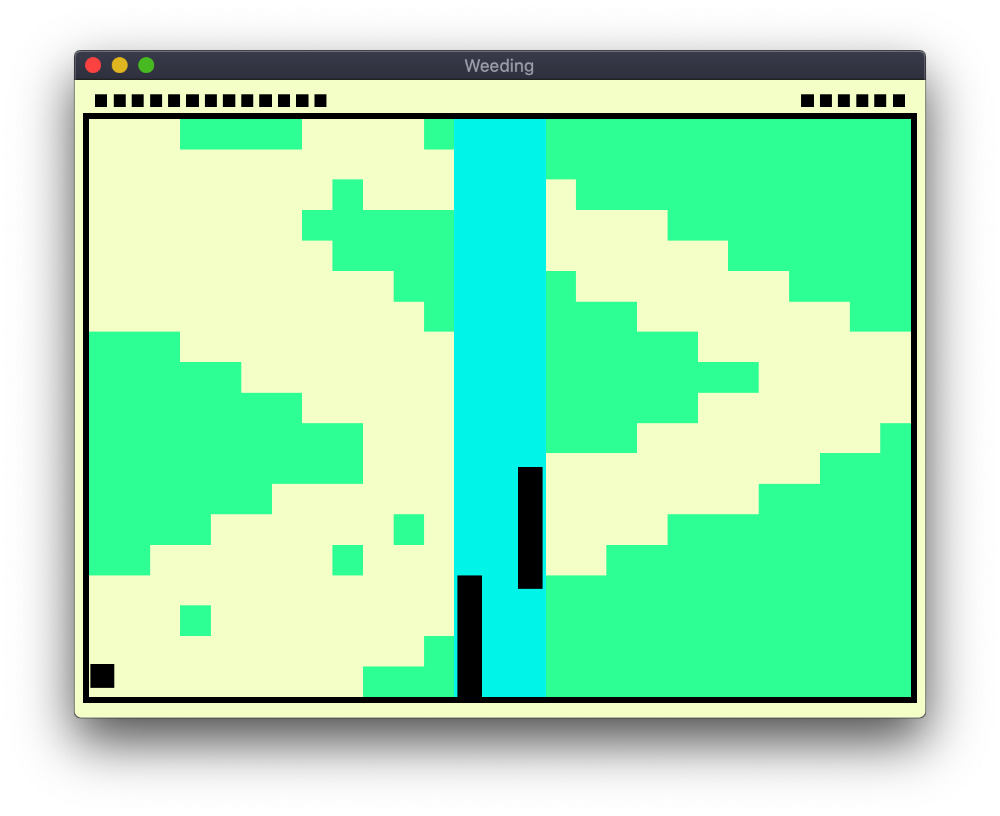

# Weeding

Author: Haomin Wang (haominw)

Design: First, try to get the jump ball. Then, use the ball as a weeding machine to weed the grass on your side, while preventing it from going to your opponent's side. Whoever finishes weeding first wins.

Screen Shot:

How To Play:

Move you mouse up and down to control the paddle. Try to keep the weeding machine on your side.

This game was built with [NEST](NEST.md).
